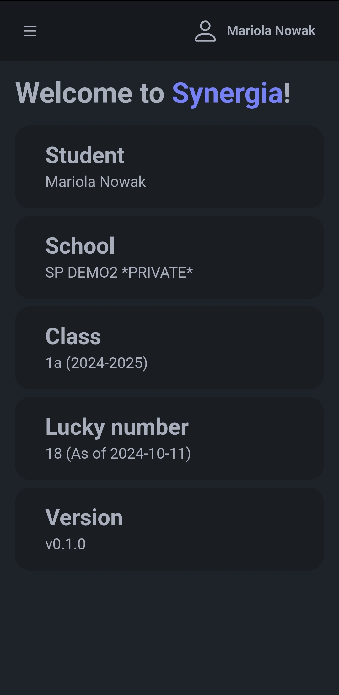
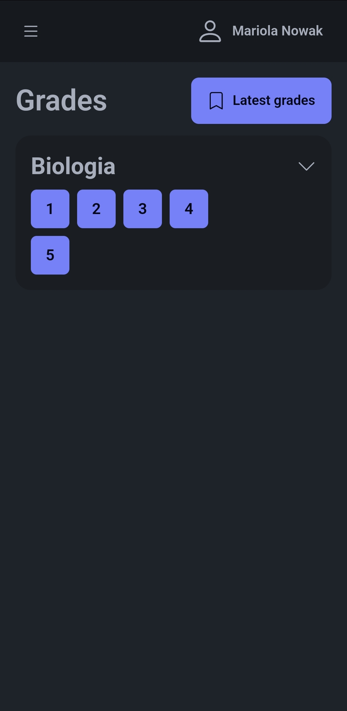
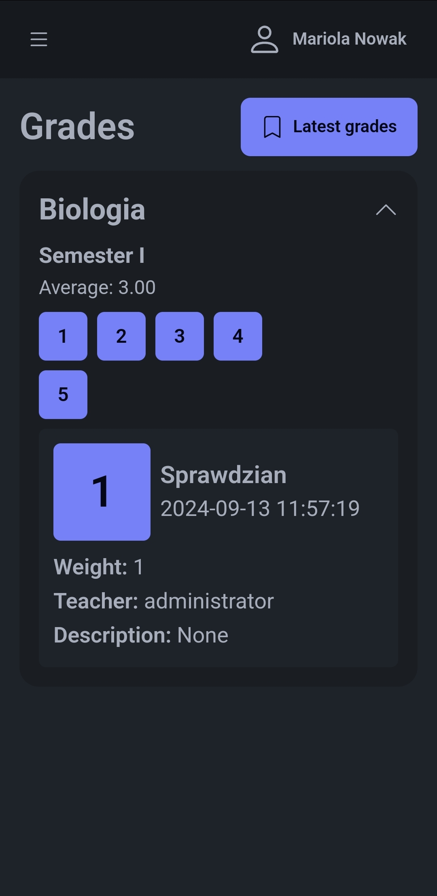
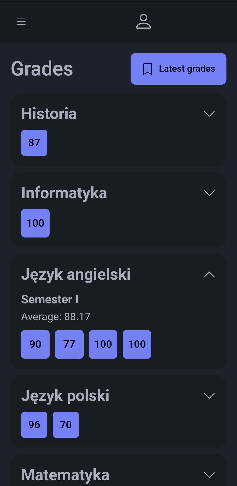
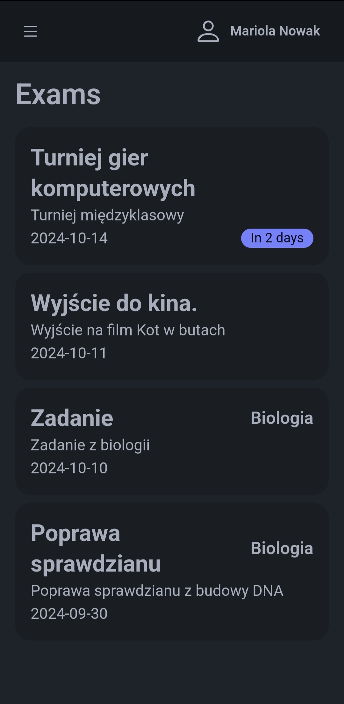
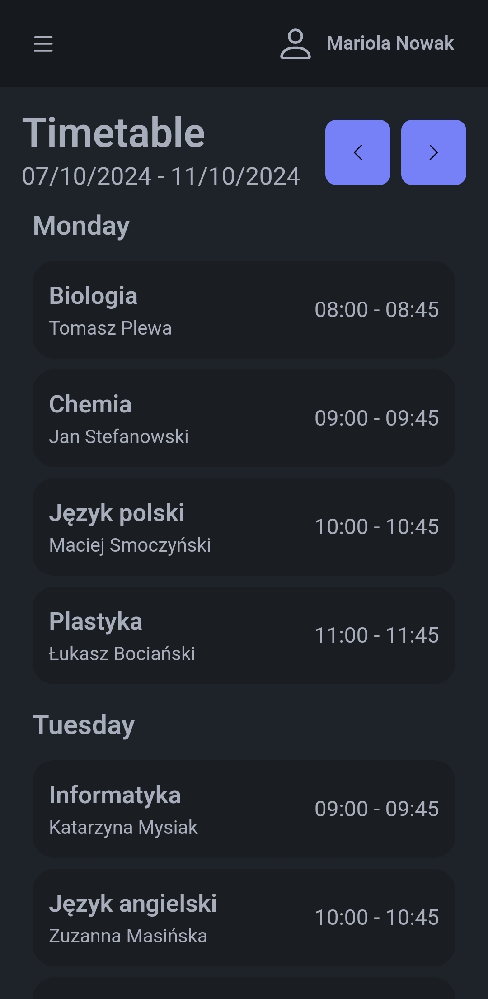

  

<h1 align="center">Librusek</h1>

  <em>Custom mobile app for Librus Synergia</em>

  
  
  
  
  

  <a href="#get-it-here">Get it here</a> •
  <a href="#check-it-out-in-action">Check it out in action</a> •
  <a href="#contact">Contact</a> •
  <a href="#credits">Credits</a>

## 📚 About

Librusek is an alternative app for [Librus Synergia](https://synergia.librus.pl/), a popular school management system in Poland. It is designed to be more user-friendly and modern than the original website.

## ✨ Supported Synergia Features

- **Logging in with Synergia**: Librusek doesn't require you to create a Librus account, instead opting for the ability to login with your pre-existing Synergia account created for you by your school administrator.
- **Landing page**: All your account information, like your name, school, and the current lucky number is available in one place.
- **Grades**: View your grades and averages for each subject. You can also see the grades added the day prior. Librusek supports both the traditional and points-based (percentages) grading systems.
- **Exams**: Know when your upcoming exams take place. You can view all your upcoming and previous exams along with their dates, all neatly sorted and highlighted for your convenience.
- **Timetable**: Stay up-to-date with your daily schedule. You can view your timetable for each week, including all substitutions and cancelled classes.
- **Attendance**: Keep track of your attendance. You can view your attendance for each subject and see the number of absences and lates.
- **Profile**: Check your profile information, including your name and synergia email. You can also check your behavior grades and notes given by your teachers - both positive and negative.
- **Messages**: Read messages from your teachers and school administration regarding important information and events.

## 🌟 Unique App Features

Since Librusek is a fully custom application, it has some unique features that are not available in the original Librus Synergia.

- **Multiple themes**: Librusek supports multiple themes, including a dark mode and a light mode. You can choose the theme that suits you best.
- **Grades simulator**: With the grades simulator, you can calculate the grades you need to achieve a specific average. You can also see how your average will change if you get a specific grade.
- **Responsive design**: Thanks to the responsive design, Librusek looks great on various mobile devices like smartphones and tablets.
- **Modern design**: Librusek has a modern and clean design that is easy to use and looks great.
- **Fast and reliable**: Librusek is built with modern technologies. It's - in most cases - faster than the official Synergia.
- **Optimized data fetching**: Librusek uses optimized methods for fetching data from the Synergia API, which makes it faster and more reliable. It also uses caching to reduce the number of network requests.

## 📥 Get it here!

## 📸 Check it out in action

  
  
  
  
  
  

## 👥 This project was brought to you by our awesome contributors!

## 🏆 Credits

The idea for Librusek was born because of [Librusik](https://github.com/dani3l0/librusik) created by [dani3l0](https://github.com/dani3l0). Some of the code (especially for authorization) was inspired by this project.

## 📬 Contact

If you have any questions or suggestions, feel free to contact me using the following methods:
- GitHub Issues: [SimonB50/librusek](https://github.com/SimonB50/librusek/issues)
- Discord: [simonb50](https://discord.com/users/426778259938738187)
- Email: [szymon.dawid@gmail.com](mailto:szymon.dawid@gmail.com)

Feel free to adjust the content and images as needed.
